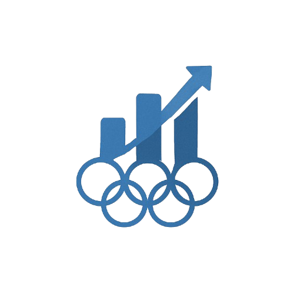

# Olympus Insight



## Overview

Olympus Insight is a comprehensive data visualization dashboard that provides in-depth analysis of Olympic Games data from 1896 to present. The dashboard leverages modern data visualization techniques to explore various aspects of Olympic history, performance metrics, and socioeconomic factors that influence Olympic success.

## Features

- **Country Profile**: Detailed performance history of each participating nation
- **Country Comparison**: Side-by-side analysis of multiple countries
- **Globe View**: Interactive global representation of Olympic participation
- **Olympic Year**: Timeline analysis of specific Olympic Games
- **Sport Profile**: Detailed analytics for individual Olympic sports
- **Host Analysis**: Impact and performance of host countries
- **Economic Factors**: Correlation between Human Development Index (HDI) and Olympic success
- **Advanced Analytics**: Statistical insights and pattern discovery
- **Predictive Models**: Machine learning-based predictions for future Olympic performance

## Technologies Used

- **Dash**: Interactive web application framework
- **Plotly**: Interactive data visualization library
- **Pandas & NumPy**: Data manipulation and analysis
- **Scikit-learn & TensorFlow**: Machine learning and predictive modeling
- **Bootstrap**: Responsive UI components

## Data Sources

- Historical Olympic athlete data
- Country-specific metrics
- HDI (Human Development Index) data
- Geographic information for global visualizations

## Installation

1. Clone the repository:
   ```
   git clone https://github.com/isuniverseok/olympus.git
   cd olympus
   ```

2. Create and activate a virtual environment:
   ```
   python -m venv venv
   source venv/bin/activate  # On Windows: venv\Scripts\activate
   ```

3. Install dependencies:
   ```
   pip install -r requirements.txt
   ```

4. Run the application:
   ```
   cd olympus-dash
   python app.py
   ```

5. Open your browser and navigate to `http://127.0.0.1:8050/`

## Project Structure

```
olympus/
├── olympus-dash/        # Main application directory
│   ├── app.py           # Main Dash application file
│   ├── data_loader.py   # Data processing utilities
│   ├── assets/          # Static assets (CSS, images)
│   ├── data/            # Dataset files
│   └── pages/           # Dashboard pages
│       ├── landing.py             # Home page
│       ├── country_profile.py     # Country analysis
│       ├── comparison.py          # Country comparison
│       ├── globe.py               # Global visualization
│       ├── olympic_year.py        # Year-specific analysis
│       ├── sport_profile.py       # Sport analysis
│       ├── host_analysis.py       # Host country analysis
│       ├── economic_analysis.py   # HDI correlation analysis
│       ├── misc_analysis.py       # Additional analytics
│       ├── prediction.py          # Predictive modeling
│       └── acknowledgement.py     # Credits and data sources
├── venv/                # Virtual environment
└── requirements.txt     # Project dependencies
```

## Usage Examples

- **Country Analysis**: Select a country to view its historical medal count, athlete participation, and performance trends
- **Sport Comparison**: Compare different sports based on participating countries, gender distribution, and medal allocation
- **Economic Correlation**: Explore how a country's economic indicators correlate with Olympic success
- **Predictive Insights**: Use machine learning models to predict future Olympic performance based on historical data

## Contributors

Group 10 - CS661 Big Data Visual Analytics

## Acknowledgements

- Kaggle dataset
- United Nations Development Programme for HDI data
